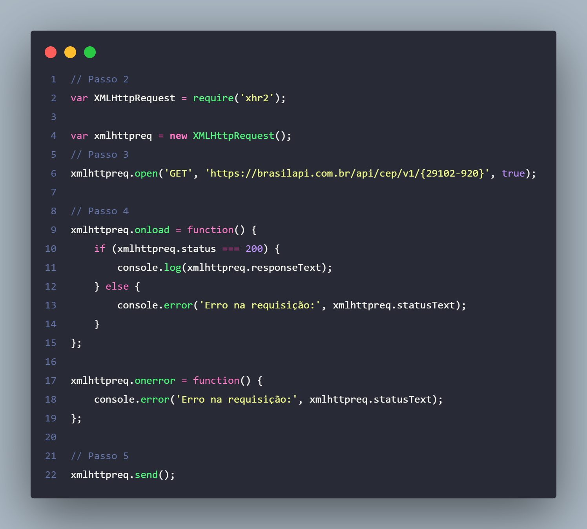

# cep-ecomerce
Atividade Online Pontuada 2: Uso de XMLHttpRequest em processamento assincrono.

## Implemntação da API XMLHttpRequest 

## Utilização

para utilização é necessário fazer uma cópia

'''
    git clone https://github.com/jailtonmonteiro/cep-ecomerce.git
'''